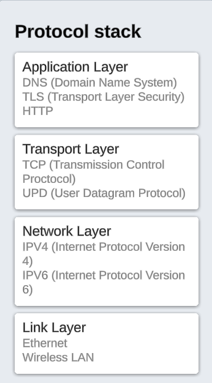

#### What is a protocol stack, and how is it used in web development?

# Protocol

Protocol is set of rule, Using protocol device or computer can communicate on internet, These protocols are organized into 7 layers, it is called OSI (open systems interconnection) Model.

but we wil mainly focus on Protocol stack, Protocol stack means 4 main layer of OSI Model.

# Protocol Stack :

1. Link Layer :

   Link layer will receive or send data through Ethernet and Wireless LAN in form of bits (0 and 1), Link Layer will send received data to Network Layer or send data to Network Layer.

2. Network Layer:

   Netwrok Layer is repsonsible to identify sender's machine and receiver's machine ip address. IP version 4 or IP version 6 is used for showing ip address (Internet Protocol).

   - we can identify ip address of window machine using `ipconfig` command.
   - but in linux we use `ifconfig` command.
   - or simply we can type on google "what is my ip address".

3. Transport Layer:

   On this Layer TCP (Transmission Control Protocol) and UDP(User Datagram Protocol) works, TCP is used for converting data into packets (segmentation) when sending data, and for converting packets back into data (reassembly) when receiving data, UDP is less reliable than TCP.

4. Application Layer:

   Application Layer receives data from or send data to transport layer using, mainly data HTTP receives data from tcp protocol.

   - If client uses HTTP protocol while sending request then client will be received response in form of HTTP.
   - If client uses HTTPS while sending request then client will be received response in HTTPS format
   - If we uses HTTPS then we use TLS (Transport Layer Security) protocol with HTTP protocol.
   - TLS and SSL (Secured Socket Layer) protocol uses for encrption of sending data and decription of receiving data
   - SSL Certificate is used identify sender or receiver secure for further communication.
   - DNS (Domain Name System) use for convert domain name to ip address
