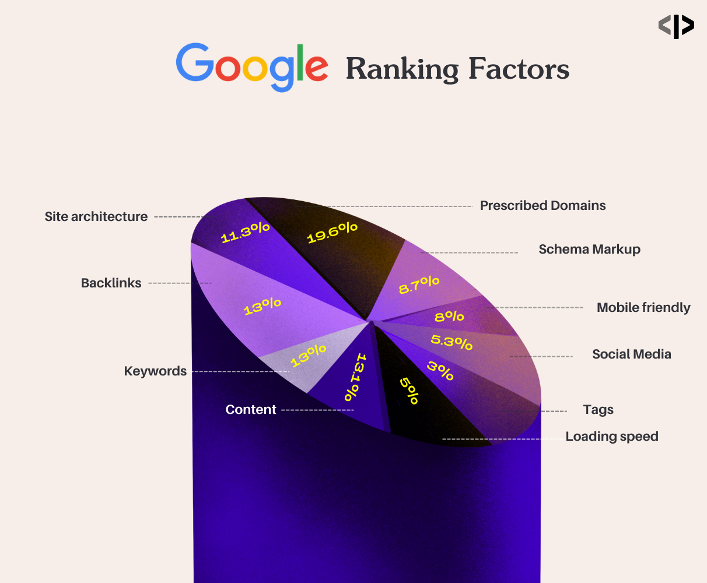

#### What is SEO (Search Engine Optimization), and how can web developers optimize their websites for better search engine rankings?

# SEO (Search Engine Optimization) :

Search engines are essential tools in web development, helping users discover relevant information online.
serach engine examples - www.google.com, www.bing.com, www.duckduckgo.com, www.yahoo.com etc.

# How Search Engine Works :

- Google hase crawler/bot/spider (computer program) which crawles every web site and inside links of web site on internet.
- Crawler gets all information of website like text, images and video etc. and according to information this website is stored in their corresponding index database.
- when user type query on google then, googles use ranking algorithm to fetch data from indexed db.
- Ranking algorith use webstie's data which is stored in indexed database and rank them according to their keyword, website's text, user engagement time.

# How Can Web Developers Optimize their Websites for better Search Engine Rankings :

1. Site Architecture (11.3%) :

   - Site architecture, also known as SEO architecture, is the foundation of good SEO for your website.
   - architecuter of side should be well arranged, links of pages should be well organised so it will be easy to user and google crawler to crawl your website for indexing.
   - website should not have 3-4 links from home page to desired page.

2. Perscribed Domains (19.6%) :

   - google or any search engine will not give preference to any domain name.
   - domain name should be short,unique, it should easyly remembered by user.
   - while using TLD, prefere to use .com beacuse user remember .com easly than other TLD.
   - do not change websites domain name, it will reduce site of visitor, keep same domain for long time.
   - avoid giving - hyphen in domain name.

3. Schema Markup (8.7%) :

   - Schema Markup is a structured data vocabulary that helps serach engines better understand the information on you website.
   - schema.org tell your search engine about your website.
   - it improves appearrence of your website on SERP (Search Engine Result Page).

4. Mobile Friendly (8%) :

   - website can be fetched from any type of devices such as, ipad,computer,mobiles etc. because of this website should be resonsive.
   - when google test our website using mobile bot wheather website is mobile friendly or not.

5. Social Media (5.3%) :

   - search engines can't ignore the imporatance of social media, social signals were implemented in the serach engine algorithms, which affect ranking.
   - the more popular the website is on social media, the more significance will hold in the search engines results. that's why companies so actively using social media and it's power can not be ignored.
   - throught social media we can increase traffic on website by sharing post on social media

   - 

6. Tags (3%) :

   - used sysmentic HTML Tags are important for SEO
   - `H1` tag should be used for only one time in all page for main heading
   - `<Strong>`, `<em>`, `<meta>` tags also important for SEO

7. Loading Speed (5%) :

   - for increasing loading speed of website, we have to minify js and html, css files and file should be loaded asychronously.
   - Defer large size of elements.
   - choose right hoisting option for your website.
   - use media compresion for images, according to google image size should be 100kb, convert images in next generation format eg. webp (webp 10kb image quality is equal to the jpeg 100kb image).
   - Enable browsing chache.
   - Apply content delivery network (CDN) eg. if your hosting your web site in india and request is comming for your website from united states then in this case it will take time to respose, so better use CDN because CDN is globally available, CDN root is available in united state.
   - if you attach css in html only then it will take time to load instead of adding css directly in css, provide external link of css same with js.
   - Enable lazy load.
   - Regular Monitoring of Website speed.

8. Content (13.1%) :

   - SEO content writing is the process for both website's user and Search engine.
   - the primary goal is to plan, create and optimize conent for google and other search engine for better ranking.
   - Elements of SEO content
     - Keyword Research and optimization
     - Convert Keywords into topics
     - internal and external linking (add links of other websites or our internal links this is good for SEO)

9. Keywords (13%) :

   - basesd on used keyword search engine can rank our website
   - Keywords can be used in meta tag, content of our web page.
   - for using there are so many tool available, by using that tools we can search rankable keyword related to our website content.

10. Backlinks (13%) :

    - Backlinks are links from outside domains that point to pages on you domain. a backlink is a link created when one website links to another.
    - backlinks are important for SEO because they represent trust form one website to another website.
    - but google sugest to create limited backlinks, otherwise website will be added to blacklist or website will be considered as spam.
