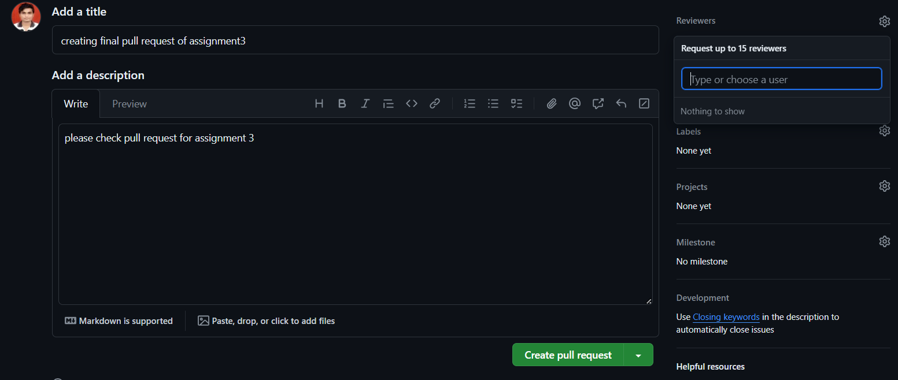

## Activity 1: Install git and play with a repository

- Create Git Folder using 'Git init' command

## 

- Create readme.md file

## 

- added file and commited

  

---

## Activity 2: Make a GitHub account and push your local repo to GitHub

- step 1 :

- Step 2 :

- Step 3 :

---

## Activity 3 : create a branch and push your changes to the branch

#### $ git status

> 

#### ‐ Creates a new branch.

#### $ git branch [branch-name]

> 

#### ‐ Switches to a different branch.

#### $ git checkout [branch-name]

> 

#### ‐ Combines git branch and git checkout into one command. It creates a new branch and switches to it.

#### $ git checkout -b [branch-name]

> 

#### Add and commit any changes you have made to the local repositiory before you push to the remote one.

#### $ git add [file]

> 

#### $ git add .

> 

#### Commits all staged files with a message about changes made.

#### $ git commit -m "commit message"

> 

#### ‐ The origin represents a remote name where you want to push changes

#### $ git push origin [branch-name]

> 

#### Deletes branch

$ git branch -d [branch-name]

> 

#### Final Activity - Make a PR to main branch

- step 1 :

> 

- step 2 :

> 

- step 3 :

> 
