# Step 1: Create a GitHub Account If you do not already have a GitHub account, create one at github.com.

# Step 2: Create a GitHub Account If you do not already have a GitHub account, create one at github.com.

> 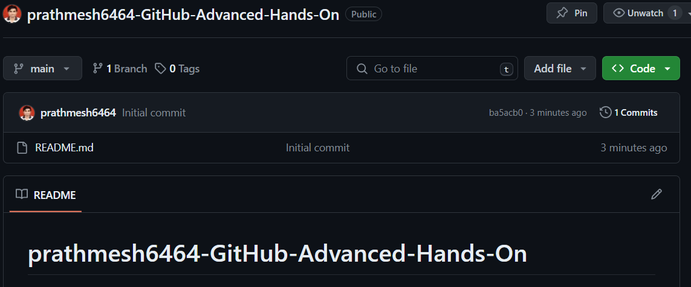

# Step 3: Clone the Repository To clone the repository, go to the repository page on GitHub and click on the “Code” button. This will open a menu with a URL that you can use to clone the repository. Open a terminal window and navigate to the directory where you want to clone the repository. Use the following command to clone the repository:

> 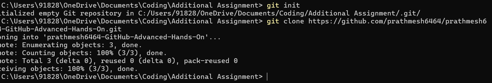

# Step 4: Create and Manage Branches Create a new branch called “dev” using the following command:

# Switch to the new branch using the following command:

> 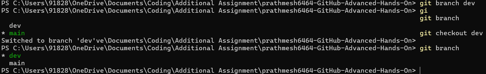

### Make changes to the “hello.txt” file by adding the following line to the end of the file:

#### This is a dev branch change.

#### Save the file and close it.

# Step 5: Commit Changes to the Dev Branch

> 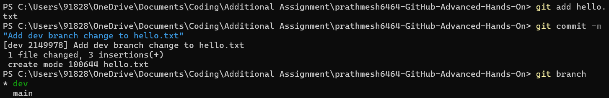

# Step 6: Push Changes to the Dev Branch Push the changes to the dev branch using the following command:

> 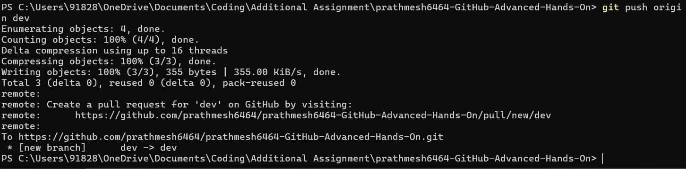

# Step 7: Resolve Conflicts Switch back to the main branch using the following command:

> 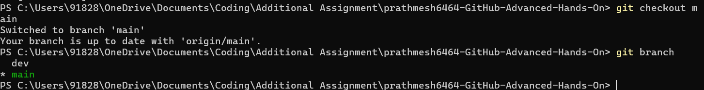

##### Make changes to the “hello.txt” file by adding the following line to the end of the file:

##### This is a main branch change.

##### Save the file and close it.

##### Try to merge the dev branch into the main branch using the following command:

> 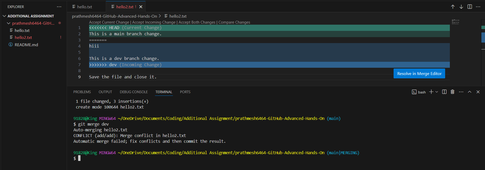

> 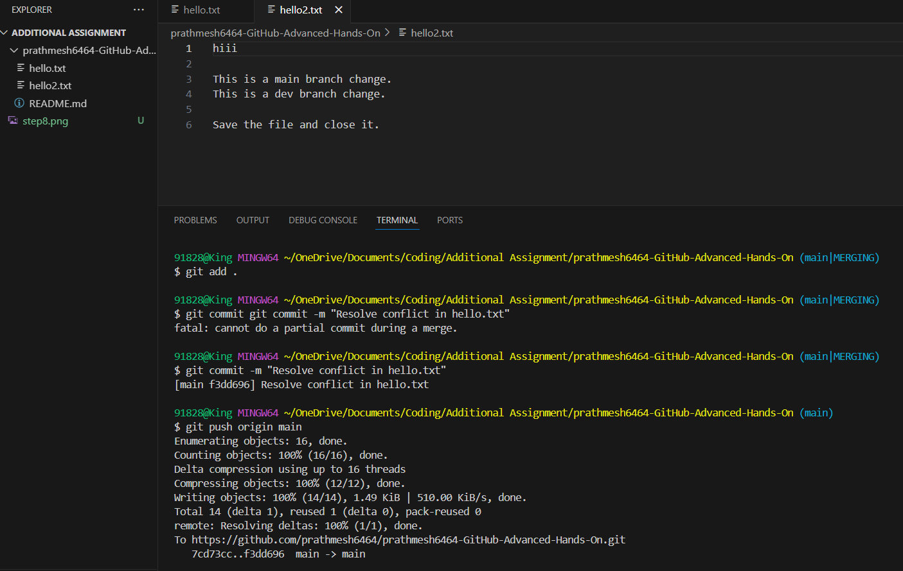

# Step 9: Work with Remote Repositories Create a new repository on your local machine using the following command:

#### Add the remote repository using the following command:

#### Fetch the changes from the remote repository using the following command:

#### Create a new branch called “feature” and switch to it using the following commands:

> 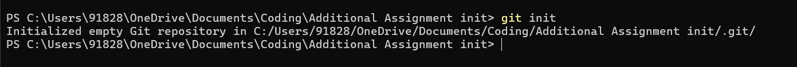 > 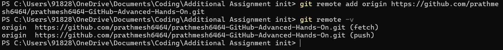 >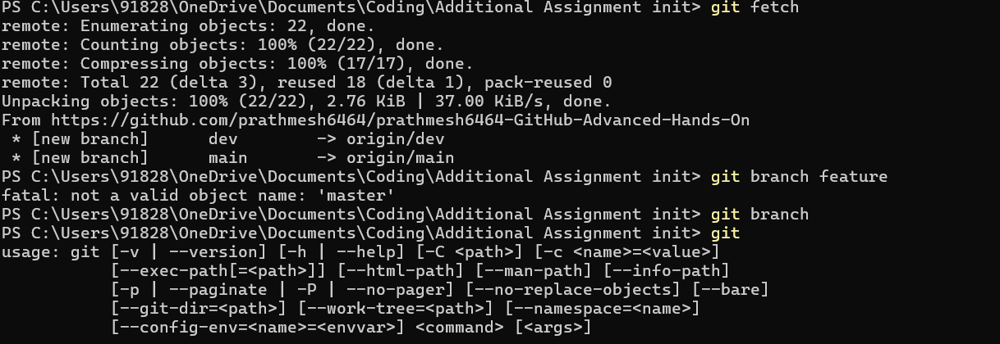 >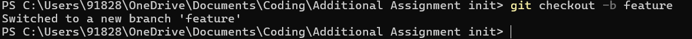

# Step 10: Commit and Push Changes to the Feature Branch Add the changes to the feature branch and commit them using the following commands:

> 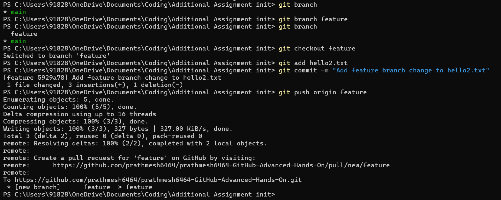

# Step 11: Create a Pull Request Go to the GitHub repository page and click on the “Pull requests” tab. Click on the “New pull request” button. Select the main branch as the base branch and the feature branch as the compare branch. Review the changes and click on the “Create pull request” button.

> 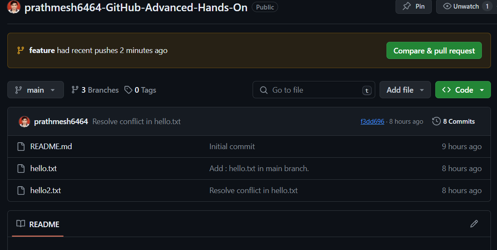 > 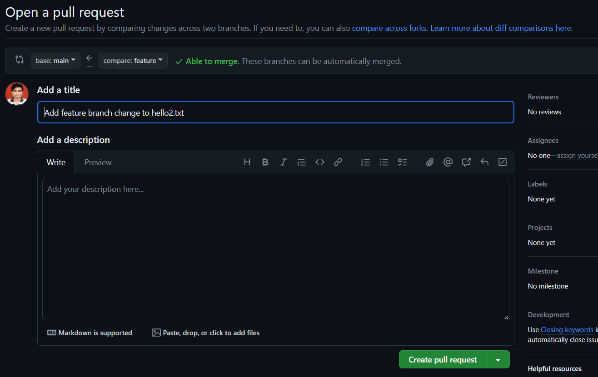 > 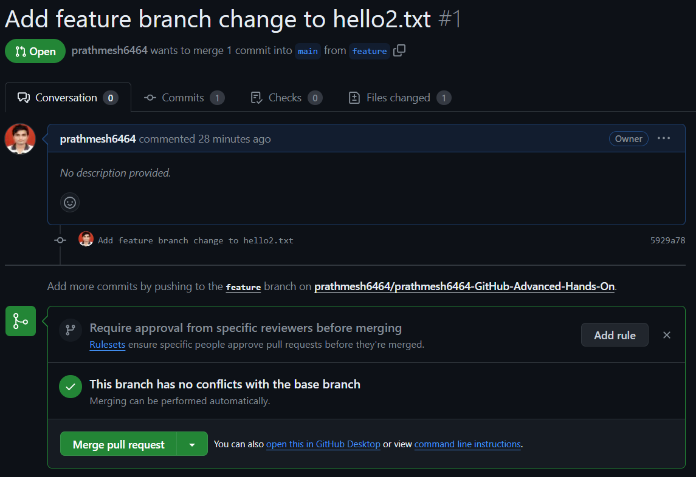

# Step 12: Merge the Pull Request Review the pull request and click on the “Merge pull request” button to merge the changes into the main branch.

> 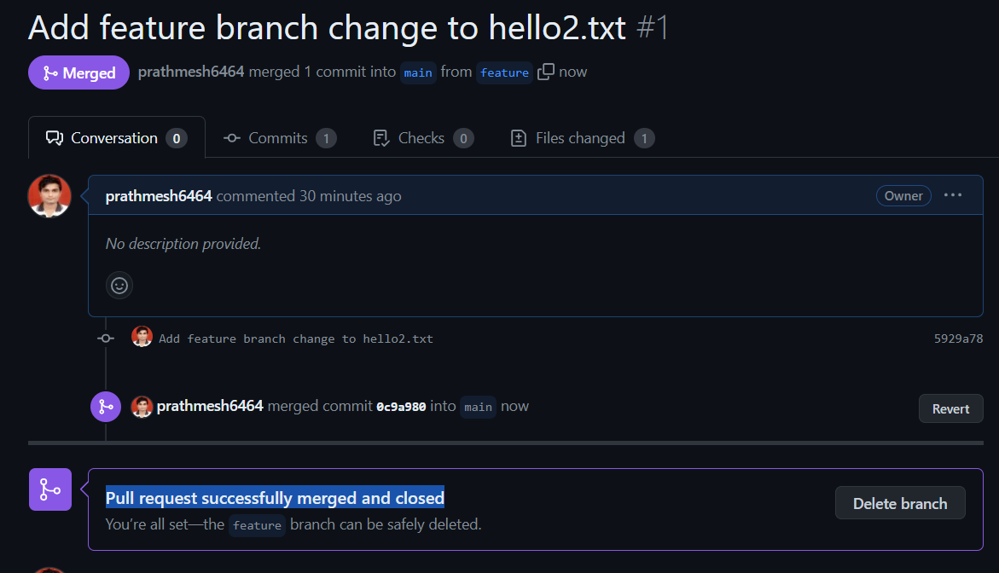

# Step 13: Use Git Command Line Tools Open a terminal window and navigate to the directory where you cloned the repository. Use the following command to view the commit history:

> 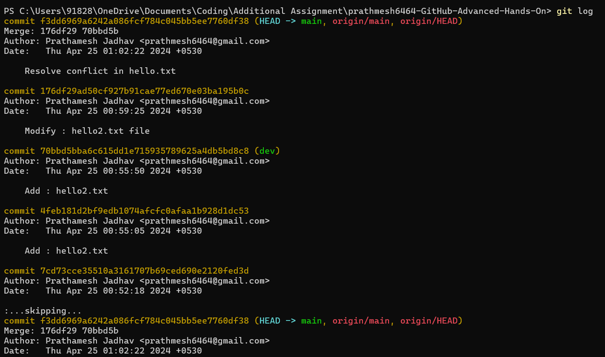

- pull request for latest changes then git log

> 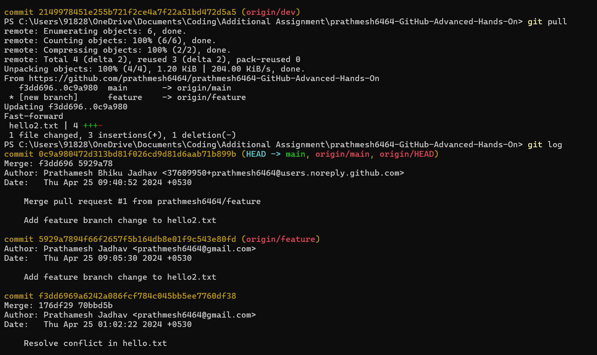

- git status

  > 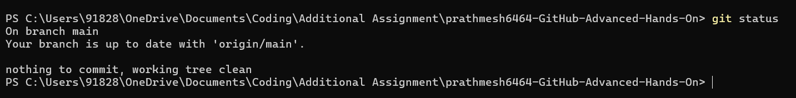

- git checkout -b new-branch-name

  > 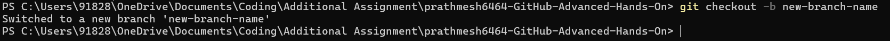

- git branch -d new-branch-name

  > 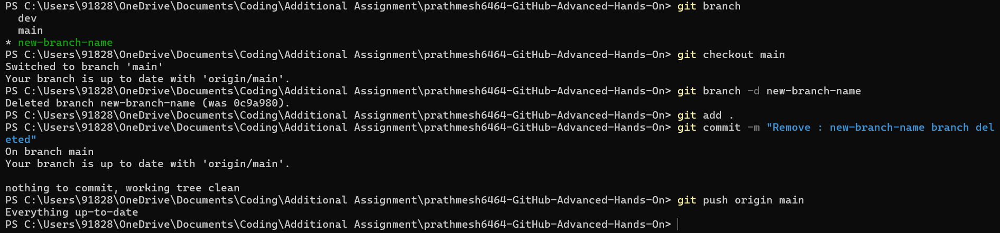

- git revert 5929a7894f66f2657f5b16
  > 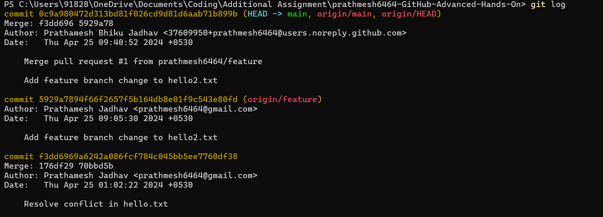 > 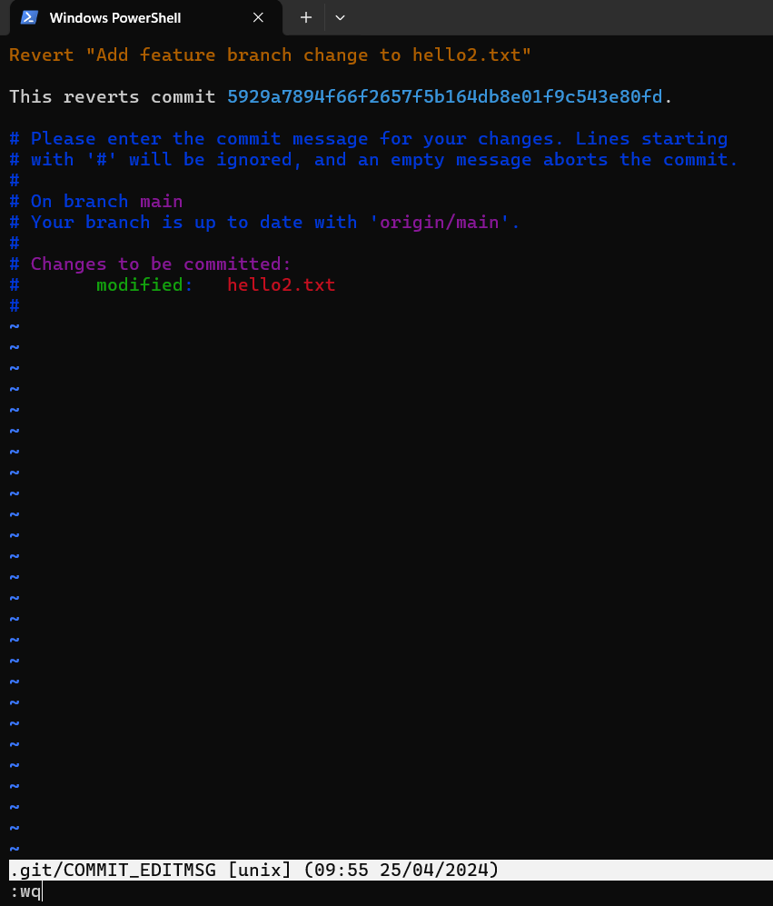 > 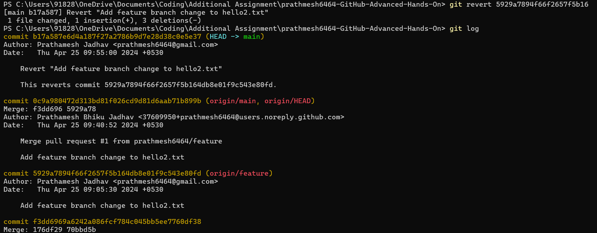
